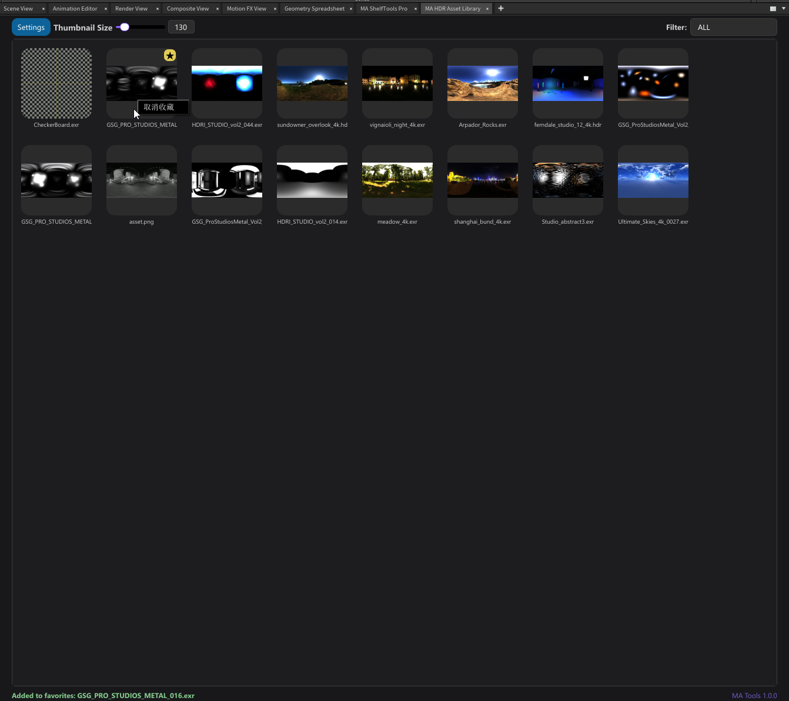
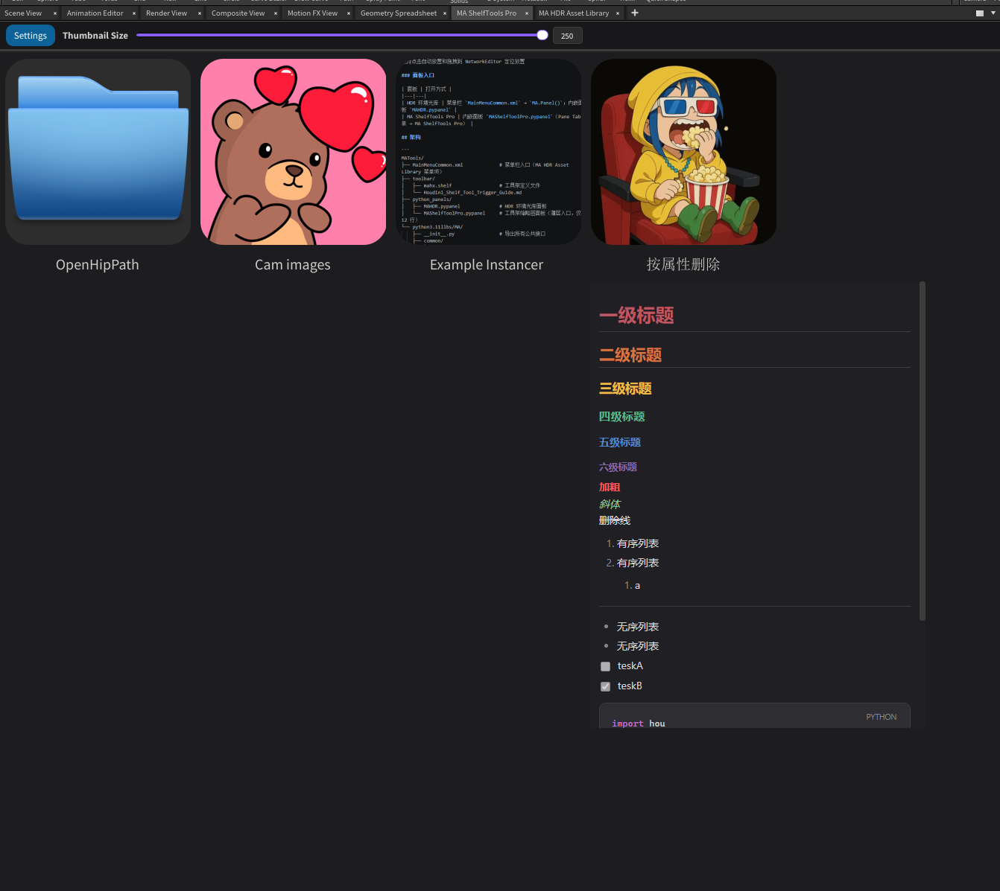
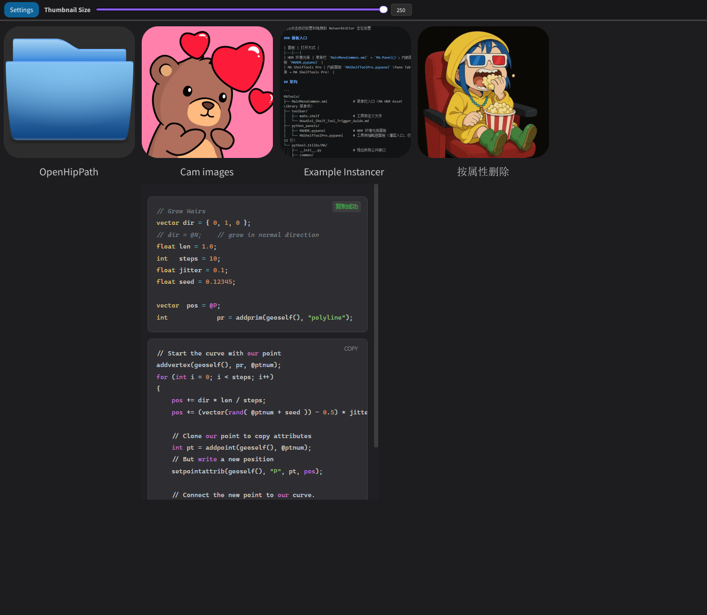
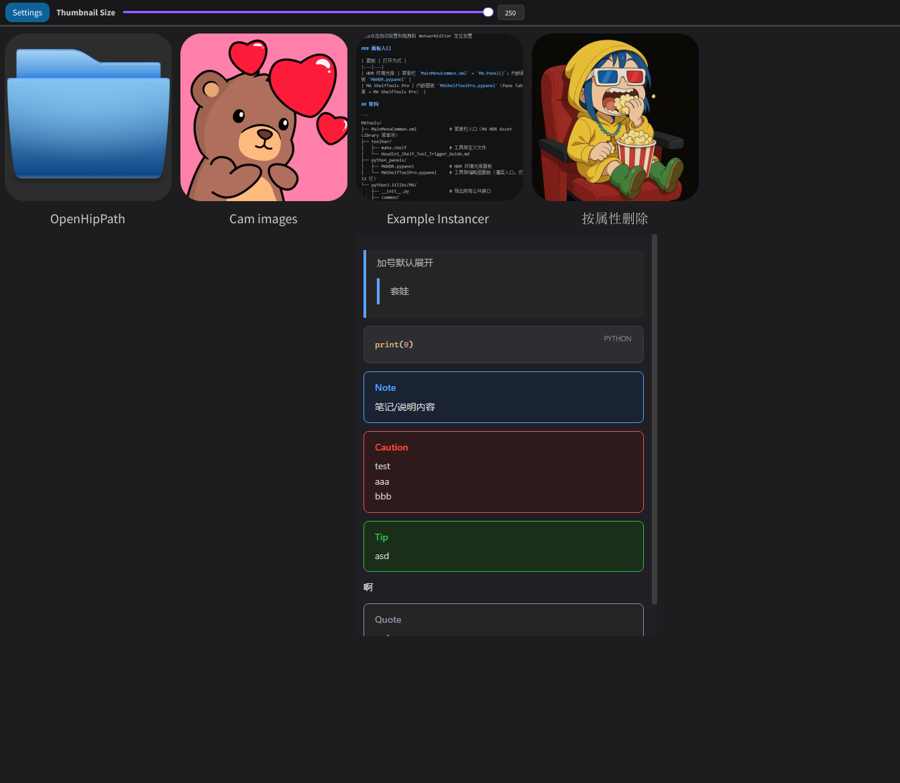
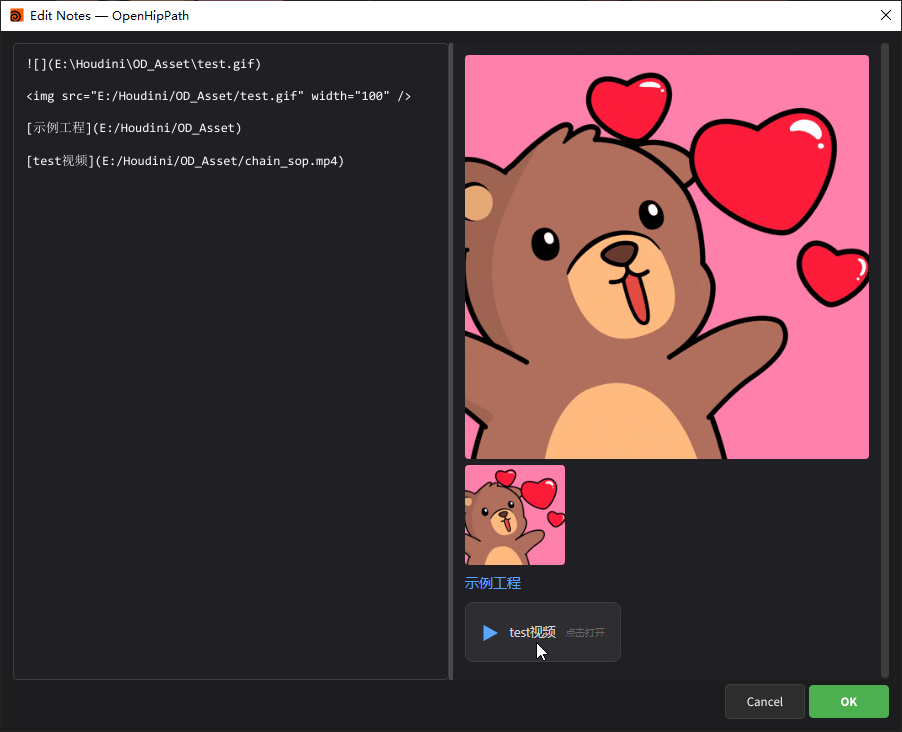

# MATools - Houdini PySide6 工具集

<div align="center">


**一套为 Houdini 21.0 打造的 PySide6 图形化工具集，提供 HDR 环境光库管理与工具架缩略图面板两大核心功能。**

### 技术栈


</div>

---

##  功能预览

### HDR 环境光库
扫描目录自动生成缩略图，一键加载 HDR 到场景环境光节点。

<div align="center">
  
  <br/>
  <em>HDR 库面板：缩略图网格、大小调节、文件夹筛选、收藏管理</em>
</div>

### MA ShelfTools Pro
工具架工具以缩略图形式展示，支持点击执行、拖拽定位、GIF 动画、Markdown 备注系统。

#### 备注样式展示

<div align="center">
  <table>
    <tr>
      <td align="center">
        
        <br/>
        <em>基础样式：标题、列表、代码块</em>
      </td>
      <td align="center">
        
        <br/>
        <em>代码高亮：VEX 语法高亮、一键复制、VitePress 风格</em>
      </td>
    </tr>
  </table>
</div>

<div align="center">
  
  <br/>
  <em>Callout 提示块：Note / Caution / Tip / Quote</em>
</div>

#### 备注编辑器

<div align="center">
  
  <br/>
  <em>编辑窗口：左编辑 / 右预览，支持 GIF、图片、视频链接实时渲染</em>
</div>

---

## ✨ 核心功能

### 🖼️ HDR 环境光库面板
- **自动扫描**：支持 HDR/EXR/PNG/JPG 等格式，自动生成缩略图网格
- **一键加载**：点击缩略图直接加载到场景环境光节点
- **智能筛选**：文件夹分类、收藏列表、最近使用记录
- **占位图过滤**：自动隐藏生成失败的灰色占位图
- **双模式打开**：支持菜单栏弹窗模式与 Pane Tab 内嵌模式
- **状态记忆**：窗口位置、大小、筛选状态自动保存

### 🛠️ MA ShelfTools Pro
- **缩略图展示**：将工具架工具以可视化缩略图呈现
- **精准放置**：
  - **点击**：自动放置到当前 NetworkEditor
  - **拖拽**：拖拽到 NetworkEditor 精确定位放置
- **GIF 动画**：自定义 GIF 缩略图，悬停 500ms 自动播放
- **Markdown 备注**：
  - **悬停预览**：鼠标悬停显示浮动备注面板
  - **中键查看**：中键点击打开独立查看窗口
  - **右键编辑**：分屏编辑器，实时 Markdown 渲染
- **高度定制**：
  - 自定义缩略图（JPG/PNG/GIF）
  - 自定义工具显示名称
  - 缩略图大小实时调节（70~250px）

---

## 📦 安装

### 1. 添加路径
将MAHX_Tools文件夹放置与Houdini环境变量目录下（位于 `Documents/houdini21.0/`）：

并将其中的MAHX_Tools.json文件拷贝到packages下（没有则创建）

### 2. 依赖检查
| 依赖 | 说明 | 状态 |
|------|------|------|
| **Houdini 21.0+** | Python 3.11 运行时 | ✅ 必需 |
| **PySide6** | Qt 绑定 | ✅ Houdini 内置 |
| **PySide6-Addons** | QWebEngineView | ✅ Houdini 内置 |
| **ffmpeg** | HDR 缩略图生成 | ❌ 需要自行下载 |

---

## 🚀 使用指南

### 打开面板

| 面板 | 打开方式 |
|------|----------|
| **HDR 环境光库** | 菜单栏 `MATools` → `MA HDR Asset Library` |
| **HDR 环境光库** | Pane Tab 菜单 → `MA HDR Asset Library` |
| **ShelfTools Pro** | Pane Tab 菜单 → `MA ShelfTools Pro` |

### 交互操作

#### ShelfTools Pro
| 操作 | 效果 |
|------|------|
| **左键点击** | 执行工具（自动放置） |
| **拖拽到 NetworkEditor** | 精确定位放置工具 |
| **右键菜单** | 改名 / 设置图片 / 编辑备注 |
| **中键点击** | 查看备注（无备注则无反应） |
| **鼠标悬停** | 显示浮动备注面板（500ms 延迟） |

#### HDR 环境光库
| 操作 | 效果 |
|------|------|
| **左键点击** | 加载 HDR 到场景环境光节点 |
| **文件夹下拉框** | 按子文件夹筛选 |
| **收藏/最近** | 快速访问常用 HDR |
| **Hide gray** | 隐藏生成失败的占位图 |

---

## 🏗️ 项目结构

```
MAHX_Tools/
├── MainMenuCommon.xml             # 菜单栏入口
├── toolbar/
│   └── MA.shelf                   # 工具架定义
├── python_panels/
│   ├── MAHDR.pypanel              # HDR 内嵌面板入口
│   └── MAShelfToolPro.pypanel     # ShelfTools 内嵌面板入口
── python3.11libs/
│   └── MA/
│       ├── __init__.py            # 公共接口导出
│       ├── common/                # 公共模块
│       │   ├── constants.py       # 路径常量、UI 配置
│       │   ├── settings.py        # JSON 配置管理器
│       │   ├── filter_manager.py  # 筛选/收藏管理
│       │   ├── styles.py          # Qt 样式表
│       │   ├── animation_helper.py # UI 动画
│       │   └── utils.py           # ffmpeg 查找、文件扫描
│       ├── hdr_library/           # HDR 库模块
│       │   ├── main.py            # Panel() 入口
│       │   ├── library_panel.py   # 主 UI
│       │   ├── thumbnail_worker.py # 缩略图生成线程
│       │   ├── thumbnail_manager.py # 网格管理
│       │   └── thumbnail_widget.py # 缩略图控件
│       └── shelf_tool_pro/        # ShelfTools 模块
│           ├── panel.py           # 主 UI
│           ├── thumbnail_widget.py # 缩略图控件
│           ├── web_renderer.py    # Markdown 渲染器
│           ├── markdown_text_edit.py # 智能编辑器
│           ├── shelf_loader.py    # shelf 加载执行
│           ├── styles.py          # 样式常量
│           └── vendor/            # Vendored 前端库
│               ├── marked.min.js  # marked.js v15.0.12
│               ├── highlight.min.js # highlight.js v11.11.1
│               └── template.html  # HTML 渲染模板
├── ffmpeg.exe                     # 自行下载 ffmpeg
└── assets/                        # 文档图片
```

---

## ⚙️ 技术细节

### 缩略图生成
- 使用 ffmpeg 提取 HDR/EXR 第一帧并缩放
- 失败时返回共享灰色占位图
- 三级缓存：内存缓存 → 磁盘缓存 → 重新生成

### 圆角绘制
- 不使用样式表 `border-radius`（DPI 兼容性问题）
- 使用 `QPainterPath` + `setClipPath` 代码绘制
- `image_label` 尺寸 +2px 缓冲防止裁剪

### GIF 动画
- 连接 `QMovie.frameChanged` 信号
- 每帧手动缩放、居中、应用圆角遮罩
- 悬停 500ms 播放，离开停止

### Markdown 渲染
- QWebEngineView + marked.js + highlight.js
- VitePress 风格代码高亮
- Callout 提示块（Note/Tip/Warning/Caution/Quote）
- 媒体文件链接自动渲染为可点击卡片

### 工具架触发
- `hou.shelves.loadFile()` 注册工具
- `exec(tool.script(), globals_dict)` 注入上下文
- 点击自动查找 NetworkEditor，拖拽使用 `cursorPosition()`

---

## 📝 配置管理

### 设置与缓存分离
| 文件 | 内容 | 保存时机 |
|------|------|----------|
| `MA_HDR_Library_Settings.json` | HDR 目录、窗口几何、收藏 | 实时写入 |
| `MA_HDR_Library_Cache.json` | 缩略图路径、mtime 快照 | 关闭时写入 |
| `MA_ShelfTools_Pro_Settings.json` | 缩略图大小、目录路径 | 实时写入 |
| `MA_ShelfTools_Pro_Cache.json` | 自定义图片、名称 | 实时写入 |


### 备注存储
备注以独立 `.md` 文件存储在 `MA_ShelfTools_Pro_Notes/` 目录，每个工具对应 `{unique_id}.md`。

---

##  许可证

本项目使用的第三方库：

- [marked.js](https://github.com/markedjs/marked) - MIT License
- [highlight.js](https://github.com/highlightjs/highlight.js) - BSD 3-Clause License

对应许可证文件见项目根目录。

---

<div align="center">
  <sub>Built with ❤️ for Houdini Artists</sub>
</div>
